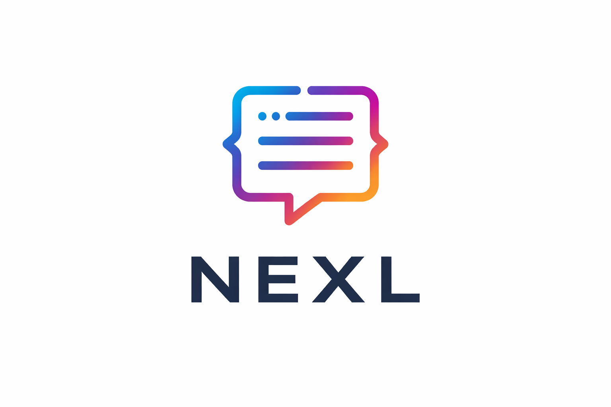

 

# NEXL — Natural Expression Language

> **NEXL** is a plain-text notation language for expressing **intent, ambiguity, branching, sequence, and relationships** in a way that is natural for humans and precise for AI.

NEXL sits between **human thinking** and **machine reasoning**. It is designed to be:

* easy to write (paper & keyboard friendly)
* easy to read (low cognitive load)
* easy for AI to parse (low token usage, explicit semantics)

---

## Why NEXL?

Most text formats fall into two extremes:

* **Prose** (natural language): expressive but ambiguous
* **Code / config** (JSON, YAML): precise but verbose and cognitively heavy

NEXL fills the gap.

It lets you:

* mark ambiguity explicitly
* branch instead of guessing
* express sequence and relationships clearly
* keep structure without boilerplate

This makes NEXL ideal for:

* precise AI prompts
* reasoning notes
* decision trees
* flow descriptions
* text-based diagrams (Mermaid-style thinking)

---

## Quick Example

```nxl
Should I eat today?
=> yes
    1. eat soon
    2. gain calories
=> no
    1. fasting
    2. weight loss -> Risks of Weight Loss
```

Readable by humans. Clear to AI.

---

## Core Concepts (At a Glance)

### Ambiguity

```text
Something?
```

* `?` marks uncertainty
* demands resolution

---

### Branching (Alternatives)

```text
Something?
=> option A
=> option B
```

* `=>` introduces alternative paths
* branches are siblings (no implied order)

---

### Sequence

```text
step 1 > step 2
```

* `>` means execution order

---

### Ordered Steps

```text
1. main step
1.0 prerequisite added later
1.1 sub-step
```

* numbers express sequence
* decimals allow drill-down without renumbering

---

### Relationships

```text
User -> Account
```

* structural relationship
* no time implied

---

### Certainty

```text
battery - bulb
battery -- bulb
```

* `-` confirmed connection
* `--` tentative / assumed connection

---

## Tables

NEXL uses **CSV-style tables** for minimal noise:

```text
name,role,priority
login,auth,high
logout,auth,low
```

* first row = header
* no ASCII borders

---

## File Extensions

* `.nxl` — canonical
* `.nexl` — accepted alias

---

## Specification

The formal language definition lives in:

* [`SPEC.md`](./SPEC.md)

---

## License

MIT License

---

## Status

* Version: **v0.1**
* Core semantics are stable
* Open to discussion and extensions without breaking changes

---

NEXL is intentionally small.

If you can read it, you already know how to write it.
